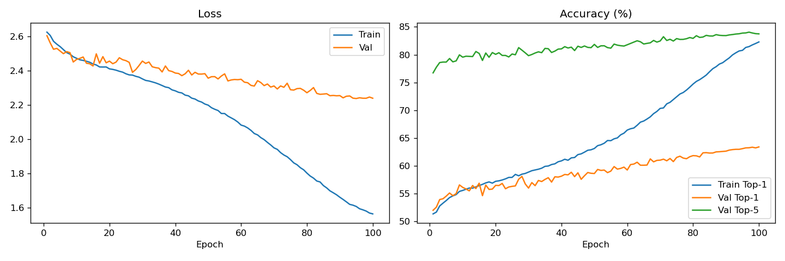

# CNN on Tiny ImageNet (From Scratch)

A custom Convolutional Neural Network trained on the [Tiny ImageNet](http://cs231n.stanford.edu/tiny-imagenet-200.zip) dataset **from scratch**, without any pretrained weights or transfer learning.

Built with PyTorch, optimized for Apple Silicon (MPS).

---

## Results

| Metric | Value |
|--------|-------|
| Val Top-1 Accuracy | **63.41%** |
| Val Top-5 Accuracy | **83.74%** |
| Parameters | 7,779,976 |
| Training Time | ~3 hours (200 epochs, Apple M-series) |

Trained for 100 epochs. No pretrained weights, no transfer learning.

---

## Dataset

**Tiny ImageNet** is a subset of ImageNet with:
- **200 classes** (WordNet IDs, e.g. `n02124075` = cat)
- **64×64 RGB images** (downsampled from original 224×224)
- **100,000 training images** (500 per class)
- **10,000 validation images** (50 per class)

### Annotation Format

| File | Format | Used for |
|------|--------|----------|
| `train/<wnid>/images/*.JPEG` | Directory structure = class label | Training |
| `val/val_annotations.txt` | `filename \t wnid \t x1 y1 x2 y2` | Validation |
| `wnids.txt` | One wnid per line (200 total) | Class index mapping |

> The bounding box columns (`x1 y1 x2 y2`) are not used — this project is image classification only.

---

## Model Architecture

A custom 5-block CNN (~7.8M parameters), designed specifically for 64×64 inputs.

```
Input: (B, 3, 64, 64)
│
├── Block 1: Conv(3→64)×2    + BN + ReLU + MaxPool → (B,  64, 32, 32)
├── Block 2: Conv(64→128)×2  + BN + ReLU + MaxPool → (B, 128, 16, 16)
├── Block 3: Conv(128→256)×2 + BN + ReLU + MaxPool → (B, 256,  8,  8)
├── Block 4: Conv(256→512)×2 + BN + ReLU           → (B, 512,  8,  8)
├── Block 5: Conv(512→512)×1 + BN + ReLU           → (B, 512,  8,  8)
│
├── Global Average Pooling                          → (B, 512)
└── FC: Linear(512→1024) + BN + ReLU + Dropout(0.5)
    Linear(1024→200)                                → (B, 200)
```

- Each block includes Dropout2d for regularization
- Conv layers: Kaiming normal initialization
- Linear layers: Xavier uniform initialization

---

## Training Setup

| Hyperparameter | Value |
|----------------|-------|
| Optimizer | SGD + Nesterov momentum (0.9) |
| Learning Rate | 0.1 → cosine annealing → 1e-5 |
| LR Warmup | 5 epochs (linear) |
| Batch Size | 256 |
| Weight Decay | 1e-4 |
| Label Smoothing | 0.1 |
| Total Epochs | 200 |

### Data Augmentation (train only)

- Random crop (64×64, padding=8)
- Random horizontal flip (p=0.5)
- Color jitter (brightness, contrast, saturation ±0.4)
- Normalize with Tiny ImageNet statistics: `mean=[0.4802, 0.4481, 0.3975]`

> All augmentation is implemented from scratch using PIL — no torchvision dependency.

---

## Project Structure

```
CNNTinyImageNet/
├── data/
│   └── tiny-imagenet-200/      # Dataset (not included, see Setup)
├── src/
│   ├── dataset.py              # Dataset classes (train + val)
│   ├── transforms.py           # Custom augmentation pipeline (PIL-based)
│   ├── model.py                # CNN architecture
│   ├── train.py                # Training and validation loops
│   ├── evaluate.py             # Standalone evaluation script
│   └── utils.py                # Device detection, checkpointing, logging
├── configs/
│   └── default.yaml            # All hyperparameters
├── checkpoints/                # Saved model weights (best.pt / last.pt)
├── logs/                       # Training curves (metrics.json + training_curves.png)
├── main.py                     # Entry point
└── requirements.txt
```

---

## Setup

**1. Clone and install dependencies**

```bash
git clone https://github.com/<your-username>/CNNTinyImageNet.git
cd CNNTinyImageNet
pip install -r requirements.txt
```

**2. Download and place the dataset**

Download [Tiny ImageNet](http://cs231n.stanford.edu/tiny-imagenet-200.zip), unzip it, and place it under:

```
data/tiny-imagenet-200/
├── train/
├── val/
├── test/
└── wnids.txt
```

---

## Usage

**Train from scratch**

```bash
python main.py
```

**Resume training from checkpoint**

```bash
python main.py --resume
```

**Evaluate a checkpoint**

```bash
python -m src.evaluate --checkpoint checkpoints/best.pt
```

After each training run, `logs/training_curves.png` is saved automatically:



---

## Environment

- Python 3.10+
- PyTorch 2.0+
- Apple Silicon (MPS) — also runs on CUDA or CPU
- No torchvision required
